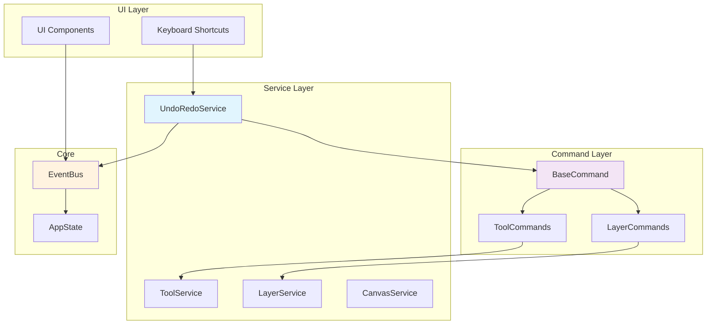

# Design Document: Undo/Redo System

## Overview

Система Undo/Redo реализует Command Pattern для обеспечения возможности отмены и повтора операций в редакторе пиксельарта. Система интегрируется с существующей архитектурой EventBus + Services, перехватывая все изменения состояния и сохраняя их в виде команд с возможностью отката.

Основные принципы:
- **Command Pattern**: Каждая операция инкапсулируется в команду с методами execute() и undo()
- **Неинвазивная интеграция**: Существующие сервисы остаются неизменными, команды создаются через EventBus
- **Типизированные команды**: Отдельные классы команд для разных типов операций
- **Оптимизация памяти**: Сжатие данных пикселей и ограничение размера стека

## Architecture



## Components and Interfaces

### UndoRedoService

Центральный сервис управления командами и их выполнением.

```gdscript
class_name UndoRedoService
extends Node

# Стеки команд
var undo_stack: Array[BaseCommand] = []
var redo_stack: Array[BaseCommand] = []

# Настройки
var max_history_size: int = 50
var is_recording: bool = true

# Основные методы
func execute_command(command: BaseCommand) -> void
func undo() -> void
func redo() -> void
func can_undo() -> bool
func can_redo() -> bool
func clear_history() -> void
func start_recording() -> void
func stop_recording() -> void
```

### BaseCommand

Базовый класс для всех команд с интерфейсом Command Pattern.

```gdscript
class_name BaseCommand
extends RefCounted

var description: String = ""
var timestamp: float = 0.0

# Абстрактные методы (должны быть переопределены)
func execute() -> void:
    assert(false, "execute() must be implemented")

func undo() -> void:
    assert(false, "undo() must be implemented")

func get_memory_usage() -> int:
    return 0  # Размер в байтах для оптимизации памяти
```

### Tool Commands

Команды для операций инструментов рисования.

#### PixelCommand
Базовая команда для операций с пикселями:
```gdscript
class_name PixelCommand
extends BaseCommand

var layer_id: int
var pixel_changes: Dictionary  # Vector2i -> {old: Color, new: Color}

func execute() -> void:
    _apply_changes(pixel_changes, "new")

func undo() -> void:
    _apply_changes(pixel_changes, "old")

func _apply_changes(changes: Dictionary, color_key: String) -> void:
    # Применяет изменения к слою через LayerService
```

#### BrushCommand / EraseCommand
```gdscript
class_name BrushCommand
extends PixelCommand

func _init(layer_id: int, positions: Array[Vector2i], color: Color):
    # Инициализация с данными кисти
```

#### FillCommand
```gdscript
class_name FillCommand
extends PixelCommand

var fill_area: Array[Vector2i]
var old_color: Color
var new_color: Color

func _init(layer_id: int, start_pos: Vector2i, old_color: Color, new_color: Color, contiguous: bool):
    # Вычисляет область заливки и сохраняет изменения
```

#### SelectionMoveCommand
```gdscript
class_name SelectionMoveCommand
extends BaseCommand

var layer_id: int
var selection_rect: Rect2i
var from_pos: Vector2i
var to_pos: Vector2i
var moved_pixels: Dictionary  # Сохранённые пиксели для отката

func execute() -> void:
    # Перемещает выделенную область

func undo() -> void:
    # Восстанавливает пиксели в исходные позиции
```

### Layer Commands

Команды для операций со слоями.

#### CreateLayerCommand
```gdscript
class_name CreateLayerCommand
extends BaseCommand

var layer_id: int
var layer_name: String
var was_active_before: int

func execute() -> void:
    Services.layer.create_layer(layer_name)

func undo() -> void:
    Services.layer.delete_layer(layer_id)
    if was_active_before != -1:
        Services.layer.select_layer(was_active_before)
```

#### DeleteLayerCommand
```gdscript
class_name DeleteLayerCommand
extends BaseCommand

var layer_id: int
var layer_data: Dictionary  # Полные данные слоя для восстановления
var layer_pixels: Dictionary  # Все пиксели слоя
var layer_index: int  # Позиция в списке слоёв

func execute() -> void:
    # Сохраняет данные слоя и удаляет его

func undo() -> void:
    # Восстанавливает слой со всеми данными
```

#### LayerVisibilityCommand
```gdscript
class_name LayerVisibilityCommand
extends BaseCommand

var layer_id: int
var old_visibility: bool
var new_visibility: bool

func execute() -> void:
    Services.layer.set_layer_visibility(layer_id, new_visibility)

func undo() -> void:
    Services.layer.set_layer_visibility(layer_id, old_visibility)
```

#### MoveLayerCommand
```gdscript
class_name MoveLayerCommand
extends BaseCommand

var layer_id: int
var from_index: int
var to_index: int

func execute() -> void:
    Services.layer.reorder_layer(from_index, to_index)

func undo() -> void:
    Services.layer.reorder_layer(to_index, from_index)
```

#### ClearLayerCommand
```gdscript
class_name ClearLayerCommand
extends BaseCommand

var layer_id: int
var saved_pixels: Dictionary  # Все пиксели слоя для восстановления

func execute() -> void:
    # Сохраняет пиксели и очищает слой

func undo() -> void:
    # Восстанавливает все пиксели слоя
```

## Data Models

### Command Stack Structure
```gdscript
# Структура стека команд
var undo_stack: Array[BaseCommand] = []
var redo_stack: Array[BaseCommand] = []

# Метаданные стека
var current_position: int = 0  # Текущая позиция в истории
var max_size: int = 50  # Максимальный размер стека
var total_memory_usage: int = 0  # Общее использование памяти
```

### Pixel Change Format
```gdscript
# Формат хранения изменений пикселей
var pixel_changes: Dictionary = {
    Vector2i(10, 15): {
        "old": Color.RED,
        "new": Color.BLUE
    },
    Vector2i(11, 15): {
        "old": Color.TRANSPARENT,
        "new": Color.BLUE
    }
}
```

### Layer Data Backup
```gdscript
# Формат резервной копии данных слоя
var layer_backup: Dictionary = {
    "id": 123,
    "name": "Layer 1",
    "visible": true,
    "pixels": {
        Vector2i(0, 0): Color.RED,
        Vector2i(1, 0): Color.BLUE
        # Только непрозрачные пиксели для экономии памяти
    },
    "index": 2  # Позиция в UI списке
}
```

## Correctness Properties

*A property is a characteristic or behavior that should hold true across all valid executions of a system-essentially, a formal statement about what the system should do. Properties serve as the bridge between human-readable specifications and machine-verifiable correctness guarantees.*

Перед написанием свойств проведу анализ acceptance criteria:

Теперь проведу анализ свойств для устранения избыточности:

**Property Reflection:**
Анализируя prework, выявляю следующие группы избыточности:
- Свойства 2.1-2.4 (создание команд для инструментов) можно объединить в одно общее свойство
- Свойства 3.1-3.5 (создание команд для слоёв) можно объединить аналогично  
- Свойства 2.5, 6.1 и 2.6, 6.2 дублируются
- Свойства 4.1 и 7.1 дублируются
- Свойства 8.1 и 8.2 можно объединить в одно round-trip свойство

После устранения избыточности получаю оптимизированный набор свойств:

### Property 1: Command Creation for Tool Operations
*For any* tool operation (brush, erase, fill, selection move), the system should create an appropriate Command object with complete operation data
**Validates: Requirements 2.1, 2.2, 2.3, 2.4**

### Property 2: Command Creation for Layer Operations  
*For any* layer operation (create, delete, visibility change, move, clear), the system should create an appropriate LayerCommand with complete state data
**Validates: Requirements 3.1, 3.2, 3.3, 3.4, 3.5**

### Property 3: Command Interface Compliance
*For any* Command object, it should have both execute() and undo() methods that can be called successfully
**Validates: Requirements 1.3**

### Property 4: Round-trip Operation Consistency
*For any* operation, executing it and then immediately undoing it should restore the exact previous state
**Validates: Requirements 1.4, 8.1, 8.2**

### Property 5: Undo/Redo Stack Management
*For any* sequence of operations, the undo stack should contain commands in reverse chronological order and redo stack should be cleared when new commands are added
**Validates: Requirements 2.5, 2.6, 4.3**

### Property 6: Stack Size Limitation
*For any* number of operations exceeding the limit, the undo stack should maintain exactly the maximum size by removing oldest commands
**Validates: Requirements 4.1, 4.4, 7.1**

### Property 7: EventBus Integration
*For any* undo/redo state change, appropriate events should be emitted through EventBus with correct availability status
**Validates: Requirements 5.1, 5.2, 5.3, 5.4, 5.5**

### Property 8: Keyboard Shortcut Handling
*For any* undo/redo keyboard action, the system should execute the operation only when it's available and ignore it otherwise
**Validates: Requirements 6.3, 6.4**

### Property 9: UI State Synchronization
*For any* undo/redo operation affecting layers, the AppState and UI should be updated to reflect the current state
**Validates: Requirements 8.3, 8.4**

### Property 10: Memory Management
*For any* command removal from stack, the associated memory should be properly freed and pixel data should be optimized
**Validates: Requirements 7.2, 7.4**

## Error Handling

### Command Execution Errors
- **Invalid Layer ID**: Команды проверяют существование слоя перед выполнением
- **Corrupted Pixel Data**: Валидация данных пикселей при создании команды
- **Memory Allocation Failure**: Graceful degradation при нехватке памяти

### Stack Management Errors
- **Empty Stack Operations**: Проверка доступности undo/redo перед выполнением
- **Stack Overflow**: Автоматическое удаление старых команд при превышении лимита
- **Concurrent Access**: Thread-safe операции со стеками команд

### Integration Errors
- **EventBus Disconnection**: Fallback механизмы при недоступности EventBus
- **Service Unavailability**: Проверка доступности сервисов перед вызовом
- **AppState Inconsistency**: Валидация и восстановление состояния

## Testing Strategy

### Dual Testing Approach
Система тестируется через комбинацию unit тестов и property-based тестов:

**Unit Tests:**
- Конкретные примеры команд (BrushCommand с определёнными пикселями)
- Edge cases (пустые слои, максимальный размер стека)
- Error conditions (несуществующие слои, некорректные данные)
- Integration points (EventBus события, Service вызовы)

**Property Tests:**
- Universal properties across all command types (минимум 100 итераций)
- Round-trip consistency для всех операций
- Stack management behaviour с случайными последовательностями команд
- Memory management с различными размерами данных

### Property-Based Testing Configuration
- **Library**: Godot не имеет встроенной PBT библиотеки, будем использовать custom генераторы
- **Iterations**: Минимум 100 итераций на property тест
- **Tag Format**: `# Feature: undo-redo-system, Property N: [property_text]`
- **Test Organization**: Каждое correctness property = один property-based тест

### Test Coverage Requirements
- **Command Creation**: Все типы команд должны создаваться корректно
- **Execution/Undo**: Round-trip тестирование для всех команд
- **Stack Management**: Поведение стеков при различных сценариях
- **EventBus Integration**: Корректность событий и их параметров
- **Memory Management**: Освобождение памяти и оптимизация данных

### Mock Strategy
- **LayerService Mock**: Для изоляции тестов команд слоёв
- **EventBus Mock**: Для проверки событий без побочных эффектов
- **DrawLayer Mock**: Для тестирования пиксельных операций
- **AppState Mock**: Для контроля состояния приложения